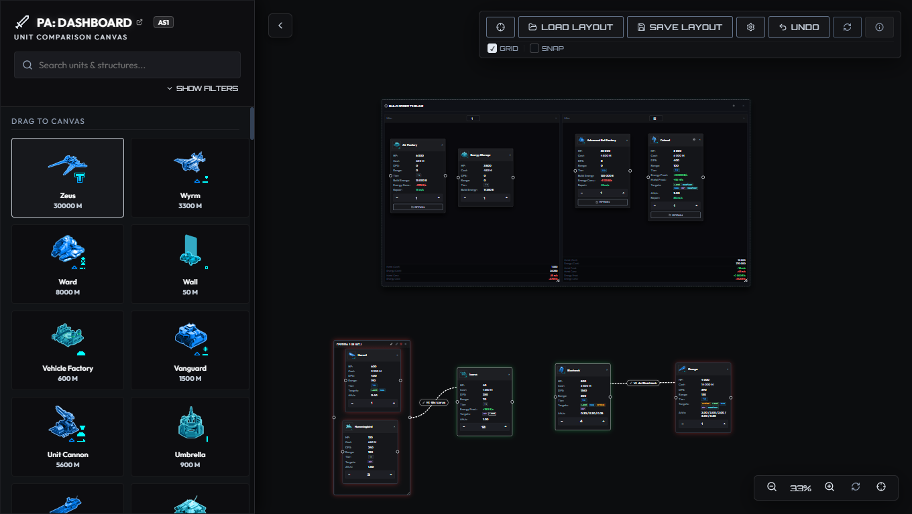
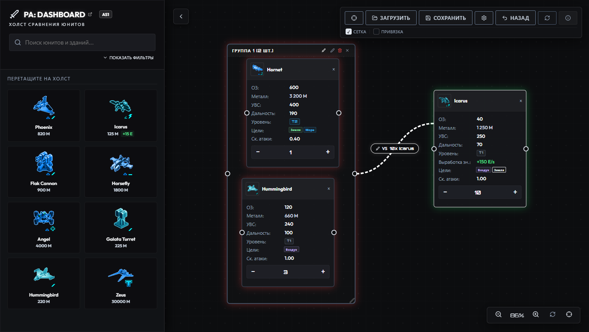
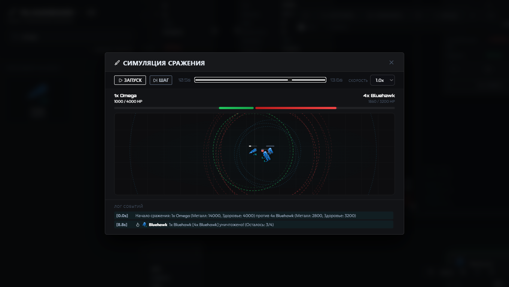
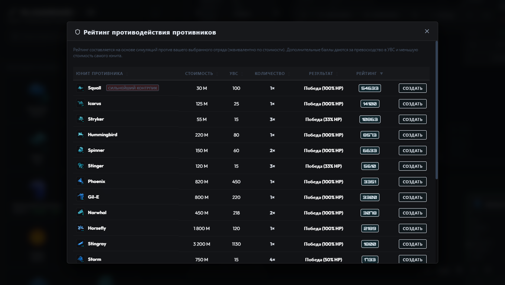
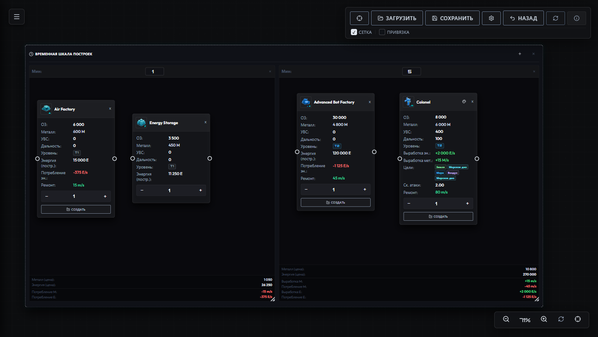
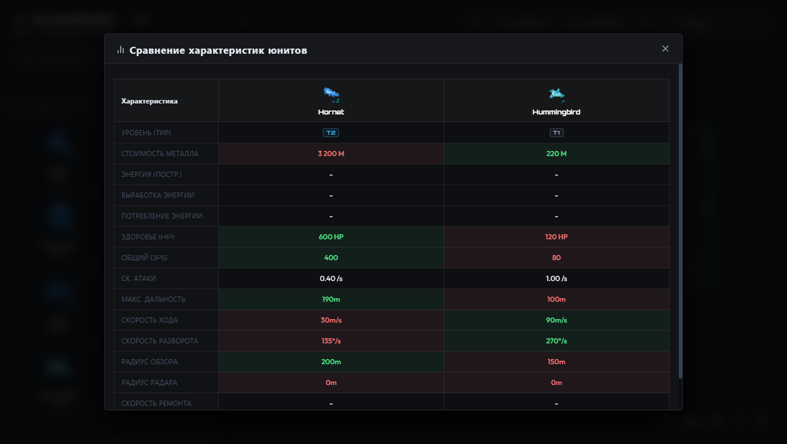
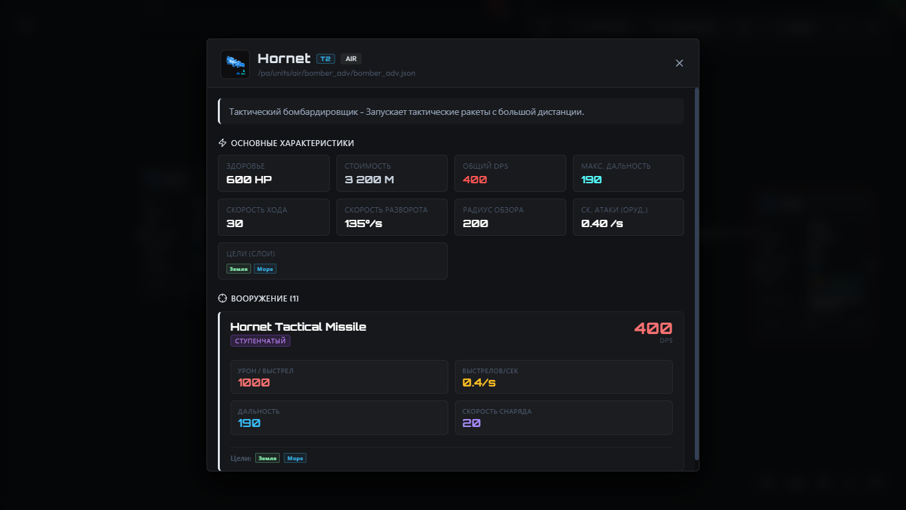

<p align="center">
  🇷🇺 <b>Русский</b> • <a href="../../README.md">🇺🇸 English</a>
</p>

---

# 🛰️ PA: Dashboard — Интерактивная Панель и Симулятор Сражений



Аналитический инструмент и тактический симулятор для игры **Planetary Annihilation: TITANS**.

Демо: https://rimuwu.github.io/PA-Dashboard/

---

## 🚀 Основные Возможности

### 1. 🗺️ Интерактивный Холст (Canvas)
* **Бесконечная сетка**: Масштабирование (Zoom) и панорамирование (Pan) с помощью мыши.
* **Гибкая сетка**: Привязка к сетке (Grid Snapping) для точного выравнивания.
* **Выделение рамкой (Marquee)**: Быстрое групповое выделение карт рамкой.
* **Групповые области (Group Areas)**: Объединяйте юнитов в отряды, изменяйте размеры областей, отслеживайте их суммарные показатели.
* **Связи (Connections)**: Стройте связи между карточками или группами для моделирования противостояний.



### 2. ⚔️ Симулятор Сражений (Combat Simulator)
* **Пошаговая симуляция**: Честный расчет боя с учетом скоростей хода, дальности стрельбы, скорострельности оружия и слоев атаки (земля, воздух, вода, орбита).
* **Анимированное воспроизведение**: Проигрывание боя с таймлайном, логами попаданий и списком выживших.
* **Подбор противодействия (Counter Matchmaker)**: Быстрый умный алгоритм (оптимизирован бинарным поиском и FastMode) подберет минимально необходимое количество юнитов для победы над выбранным отрядом.




### 3. ⏱️ Временная шкала построек (Build Order Timeline)
* **Свободный перенос (Seamless Drag & Drop)**: Перетаскивайте карточки юнитов с доски прямо в минуты временной шкалы и обратно без скачков.
* **Авто-масштабирование колонок**: Колонки автоматически увеличивают размер (ширину и высоту), чтобы вместить помещенные карточки.
* **Умный сдвиг времени**: При изменении минуты одной из колонок все последующие автоматически сдвигаются на 1 минуту вперед для сохранения порядка.
* **Калькулятор ресурсов**: Отображает затраты Металла и Энергии на постройку для каждой минуты.



### 4. 📊 Модальные Окна Сравнения и Спецификаций
* **Сравнение характеристик**: Таблица сравнения с автоматической подсветкой лучших и худших параметров (Tier, стоимость металла, HP, DPS, скорость ремонта, цели, выработка/потребление энергии).
* **Детальная информация о юните**: Полная карточка юнита с описанием оружия, урона, скорострельности и типов целей.




---

## 🛠️ Стек Технологий
* **Фреймворк**: [Vue 3](https://vuejs.org/) (Composition API, `<script setup>`)
* **Сборщик**: [Vite](https://vite.dev/)
* **Стилизация**: Vanilla CSS (поддержка темных тонов, неонового свечения, эффекта Glassmorphic и плавных микро-анимаций)
* **Иконки**: [Lucide Vue Next](https://lucide.dev/)

---

## 🔧 Запуск Проекта

### Требования
* Установленный **Node.js** (версии 18 или новее)
* Пакетный менеджер **npm**

### 1. Установка зависимостей
```bash
npm install
```

### 2. Запуск в режиме разработки (Dev Server)
```bash
npm run dev
```
После запуска проект будет доступен в браузере по адресу `http://localhost:5173`.

### 3. Сборка для продакшна (Production Build)
```bash
npm run build
```
Скомпилированные и оптимизированные файлы появятся в директории `dist/`.

---

## 🎮 Горячие Клавиши и Управление

* **Панорамирование (Pan)**: Зажмите среднюю кнопку мыши (колесо) или левую кнопку мыши на пустом месте холста и перетащите.
* **Масштаб (Zoom)**: Прокрутка колесиком мыши (Scroll).
* **Групповое выделение**: Зажмите левую кнопку мыши и растяните прямоугольную рамку.
* **Выделение поштучно**: Зажмите `Shift` и кликайте по карточкам юнитов.
* **Копирование**: Правый клик на карте -> *Дублировать карточку*.
* **Создание связи**: Зажмите мышь на порт справа/слева карточки и протяните к другому юниту/области.
* **Контекстное меню**: Правый клик на любой карточке, области или пустом месте холста открывает быстрые действия.